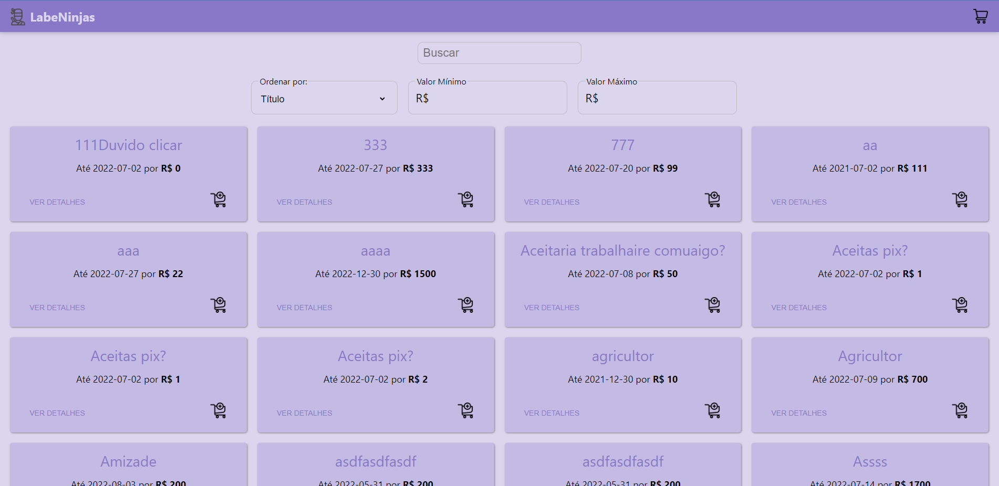
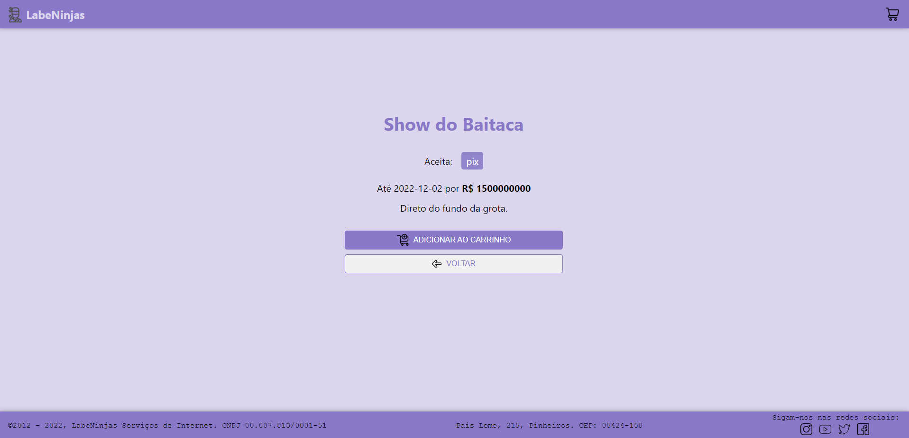
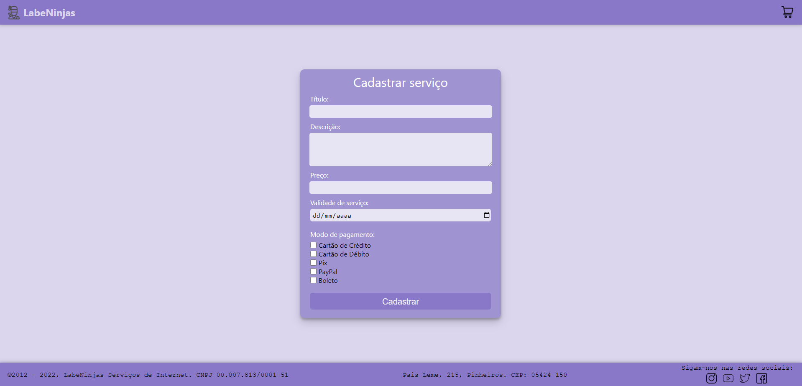
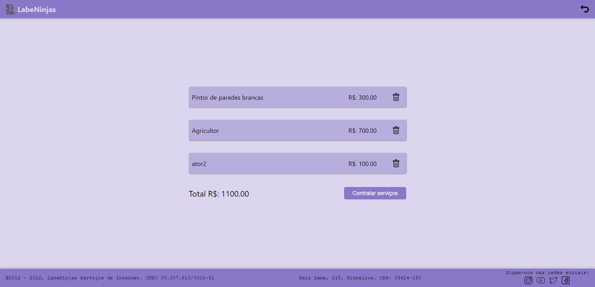

# Projeto:
Site Marketplace LabeNinjas

# Link do Surge:
https://labeninjas5-alves.surge.sh/

# Descrição:
O site LabeNinjas é um Marketplace que gerencia a maior plataforma online para conectar clientes a prestadores de serviços por todo país.  
A plataforma possui as opções de filtragem dos serviços por valor mínimo e máximo, além de filtragem por nome. Também é possível fazer a ordenação dos serviços por preços em ordem crescente, decrescente, título e prazo.  
O site possui também a opção de adicionar o serviço ao carrinho de compras, onde é possível excluir os itens e também é apresentado o valor total destes.  
Os prestadores de serviço podem cadastrar seus serviços na plataforma, informando para tal: Título, Descrição, Preço, Validade do serviço e Método de pagamento (podendo selecionar quantas opções quiser entre Cartão de Crédito, Cartão de Débito, Pix, Paypal e Boleto).

# Tecnologias utilizadas:

# Autores:
Bruna Vitória Oliveira de Sousa;
Evandro Paulo Folletto;
Olavo Marques do Nascimento;
Márleo Piber da Rosa;
Michelle da Rosa Machado.
  
# Imagens:
####Tela inicial:

####Tela contratar serviço:

####Tela detalhes do serviço:

####Tela cadastrar serviço:

####Tela carrinho:
